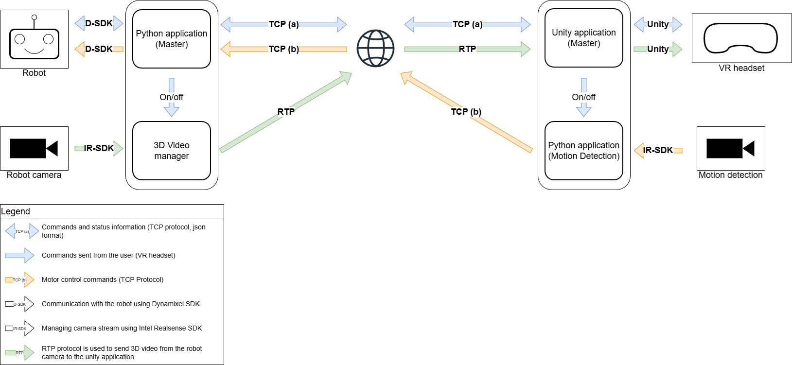

# DITS-3D

**Digital Twin Streaming 3D**: An immersive robotic teleoperation system enabling control of a humanoid robot ([Poppy](https://www.poppy-project.org/fr/)) via a VR headset (Meta Quest 3), with real-time volumetric visual feedback.

## Project Objectives

This project aims to improve environmental perception during robot teleoperation by leveraging:
- **Virtual reality** for natural 3D immersion
- **Volumetric cameras** (Intel RealSense D435/D455) to capture depth information
- **Real-time video compression** for minimal latency (<100ms)

The user can visualize the robot's environment as a dynamic 3D point cloud, move virtually through the scene, and control the robot simultaneously.

## Technical Architecture



**Video processing pipeline:**
1. **Acquisition**: RealSense camera (RGB + Z16 depth streams, 1280×720@30fps)
2. **Transformation**: Z16 → YUV conversion for standard codec compatibility according to this research paper (http://reality.cs.ucl.ac.uk/projects/depth-streaming/depth-streaming.pdf)
3. **Compression**: H.264 encoding via GStreamer (GPU acceleration)
4. **Transport**: RTP/UDP streaming over local network
5. **Visualization**: Decoding and point cloud rendering in Unity + VR

**Technologies used:**
- C++ (Intel RealSense SDK, GStreamer, image transformation)
- Unity (GStreamer plugin, RealSense plugin, VR rendering)
- Protocols: RTP/UDP for low-latency streaming

## Performance Results

| Metric | Result |
|--------|--------|
| **Framerate** | 30 fps @ 1280×720 |
| **Latency** | ~20 ms (end-to-end) |
| **Compression** | 37:1 to 53:1 (depending on scene complexity) |
| **Network bitrate** | 20-32 Mbps (vs 1.1 Gbps uncompressed) |
| **Quality** | PSNR 38-44 dB on depth stream |

## Visual Results


<table>
  <tr>
    <td></td>
    <td></td>
  </tr>
</table>
*Left: robot's real environment | Right: VR visualization in headset*

## Quick Start

**Prerequisites:**
- Windows 10/11 with NVIDIA GPU (for H.264 acceleration)
- Intel RealSense D435 or D455 camera
- Meta Quest 3 + configured Airlink
- Unity 2021+ and GStreamer 1.20+

**Installation:**
```bash
# Clone the repo with its submodules
git clone --recursive https://github.com/your-repo/DITS-3D.git

# Follow installation guides in each submodule
```

Check the `Releases` section of each submodule for pre-compiled binaries and detailed documentation.

## Authors

Project completed by **J. Charvet** and **R. Debache** during a 3-month internship (2025) at ENSEIRB-MATMECA.

## Complete Documentation

- [Full internship report](./Soutenance_stage_2A.pdf) (detailed technical analysis in french :)
- Developer guide can be found in each submodule README.md


